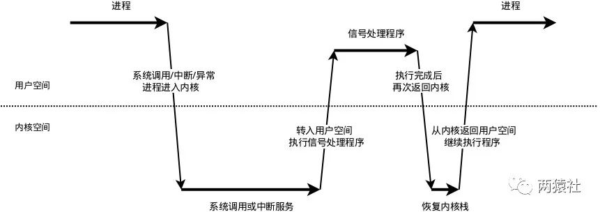

# Timer

改进书上的项目，使用优先队列构建定时器

## 概念

* 非活跃：客户端与服务端建立连接，长时间不交换数据，一直占用服务器端的文件描述符等资源
* 定时事件：固定时间触发的代码，由该段代码处理事件
* 定时器：利用结构体或其他形式，将某个事件集合封装起来。本项目封装一个检测非活跃连接的定时器
* 定时器容器：利用某种容器类数据结构，将多个定时器组装起来，便于对定时器统一管理

## Linux定时方法

* socket选项：SO_RECVTIMEO 和 SO_SNDTIMEO ： 分别用来设置socket接收数据超时时间和发送数据超时时间，所以用于与socket数据收发有关的系统调用，如send,recv,sendmsg,recvmsg,accept,connect等。
* SIGALRM信号 ： 利用alarm函数周期性触发SIGALRM信号，信号处理函数利用管道通知主循环，主循环接收到信号后对定时器容器里的所有定时器进行处理，释放非活跃连接
* IO复用系统的超时参数

## 基础API

**sigaction结构体**

```cpp
struct sigaction
{
    // 指向信号处理函数
    void (*sa_handler)(int);

    // 也是信号处理函数，参数更多，可以获得关于信号更详细的信息
	void (*sa_sigaction) (int, siginfo_t *, void *);

    // 信号掩码，指定需要被屏蔽的信号
    __sigset_t sa_mask;

    // 指定信号处理行为
    int sa_flags;

    // 一般没用
    void (*sa_restorer) (void);
};
```

```cpp
#include<signal.h>

// 功能是检查或修改与指定信号相关联的处理动作（可同时两种操作）
// signum : 要捕获的信号类型 act : 对信号设置新的处理方式 oldact : 输出信号原先的处理方式
int sigactiom(int signum, const struct sigaction *act, struct sigaction *oldact);

// 将参数set信号集初始化，然后将所有的信号加入到此信号集里
int sigfill(sigset_t *set);

// 设置信号传送闹钟，即用来设置信号SIGALRM在经过参数seconds秒数后发送给目前的进程。如果未设置信号SIGALRM的处理函数，那么alarm()默认处理终止进程.
unsigned int alarm(unsigned int seconds);

#include<sys/socket.h>
// sv[2]表示套接字柄对，可以双向通信
int socketpair(int domain, int type, int protocol, int sv[2]);
```

## 信号处理流程

在Linux中信号是异步处理机制的。当系统接收到信号时，会中断当前的程序，转到执行信号处理函数，完成后再返回中断处继续执行。  
为了避免**信号竞态**现象发生，信号处理期间系统将不再触发它。为了避免信号被长期屏蔽，信号处理函数不应执行过长。  
一般是这样执行：信号处理函数响应信号，将信号通过诸如管道等方式通知主进程，然后返回，在主进程内完成对应的逻辑操作。



* 信号的接收
  * 内核接收到信号后，将其放到对应进程的信号队列中，同时向进程发送中断，使其陷入内核态。
  
* 信号的检测
  * 进程从内核态返回到用户态前进行信号检测
  * 进程在内核态中，从睡眠状态到唤醒的时候进行信号检测
  * 当发现新的信号时,就会进入信号的处理

* 信号的处理
  * **内核** 信号处理函数运行在用户态,调用处理函数前,内核会将当前的内核栈内容辈份拷贝到用户栈,然后修改指令寄存器(eip)将其指向信号处理函数
  * **用户** 返回到用户态执行信号处理函数
  * **内核** 信号处理函数执行完后,返回内核态检测是否有其他信号
  * **用户** 如果所有信号都执行完成,就将内核栈恢复,同时恢复指令寄存器到中断前的位置,然后返回内核态继续执行